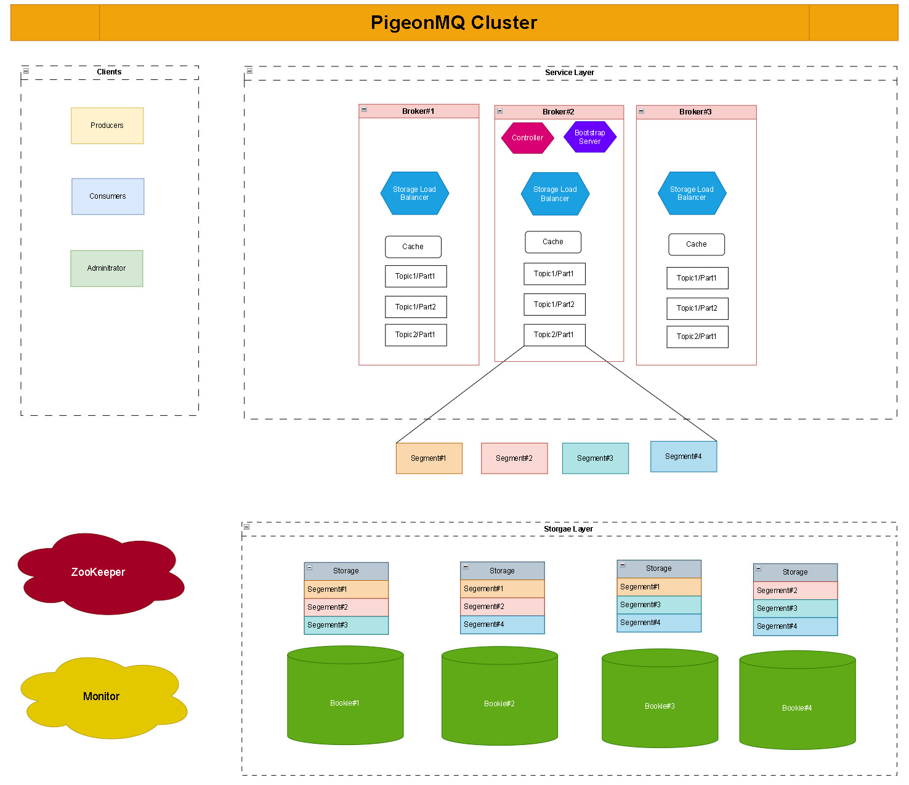

# PigeonMQ设计介绍

---

> 版本：1.0
> 
> 当前进度：开发中，存储层基本完成，待测试。

## 目标

构建一个高可用、高扩展、低时延的单集群分布式消息系统。 

高可用：无论是服务层还是存储层出现故障，只要有冗余可用，那么整个层都应该是可用的。

高扩展：如果服务层压力过大，可以通过增加broker节点来分压。如果存储层压力过大，可以通过增加bookie节点来分压。“逻辑分区、物理分段”是PiegonMQ BookieEnsemble提供高可扩展性的核心思想。

低时延：由于topic被分为partition，producer一般可以很快地把消息投放给压力较小的broker节点。

在该版本中，我不打算提供高吞吐量，因为高吞吐量意味着producer告诉生产的消息能够快速地被消费者消费。然而，由于没有consumer group这类技术被实现，consumer无法快速地在多个producer并行地高速地生产消息时高速地消费消费。

PiegonMQ应该从容地应对80MB/s的消息生产速率，将Kafka作为性能衡量标准。

---

## 架构

如何实现fault-tolerant, scalability, load balance是该项目的核心方向问题。

### 存储层(Bookie Ensemble)

对服务层提供可靠、易扩展、负载均衡、低时延的分布式AOF存储服务。

#### 工作负载假设

BookieEnsemble是为分布式消息系统定制的append-only存储。在PigeonMQ的面向工作负载中，我们认为偶尔丢失一些数据是无妨的。事实上，工业界的消息队列也作出了这样的假设，例如Apache Kafka。基于此，我们换来更高的扩展性、更低的时延和更高的可用性。但是BookieEnsemble不允许非数据到期导致的数据删除。因此，这影响BookieEnsemble如何处理对外数据服务的。

#### 设计原则

一个或多个Bookie节点组成了存储层。一个Bookie存储着一个Segment序列，每个Segement是一个Append-Only文件，其大小由配置选项maxSegmentSize确定。为了使得存储层的设计更为简单，PigeonMQ对外层提供更多的控制权，内部只是实现一个最小功能集合。

**容错机制**    多个Bookie存储着一个Segment，其中一个Bookie称为这个Segment的Leader，其它的Bookie称为这个Segment的Follower。而Segment Leader存放着的Segment则被称为PrimarySegment，Segmen Follower存放着的Segment则被称为BackupSegment。领袖选举在存储层内部发生。

**负载均衡**    Bookie允许Broker指定新建的Segment节点。另外，Bookie还需要在ZooKeeper中存放自己的负载信息。一个Segment的Leader选举是有负载意识的，这样能够避免单点负荷过重。

**段有效期**    BookieEnsemble不支持让外层请求主动删除一个segment。通过设置配置项来指定Bookie删除一个文件的有效期。

**存储信息**    Bookie在文件系统中存储着两类数据，元数据和段数据。前者提供了各个segment创建时刻的信息以及当前被关闭的segment有哪些。

**数据服务**    当segment的状态为open时，只允许读已提交，并且可以在任何bookie上读取，当追加segment时，只能在PrimarySegment中追加。当segment的状态为close时，整个segment可以被安全地读取。由

**交互**    从整体上看，一个Bookie需要和四个模块交互：ZooKeeper，其他Bookie，文件系统，Broker。详细的交互参见：`diagrams/storage-layer.drawio/interaction页`

**接口**    在 `internal/storage/bookie.go` 中列出了Bookie对外提供的API。

### 服务层

TODO

### 客户端

生产者和消费者是客户端的两种类型，PigeonMQ为它们提供了基本的消息系统功能。

生产者可以批量的发送若干条消息，从而提高网络带宽利用率。此外，通过使用gzip类的压缩工具，使用CPU时间换来更小的消息大小，减少网络I/O压力和存储压力。

TODO: Incomplete

### ZooKeeper

TODO

### 监视器

TODO
